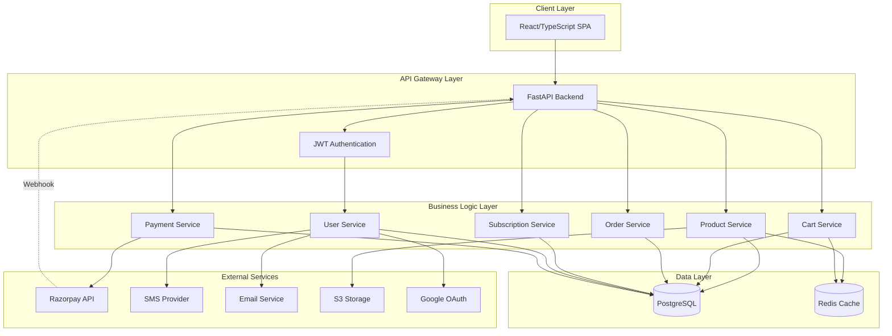
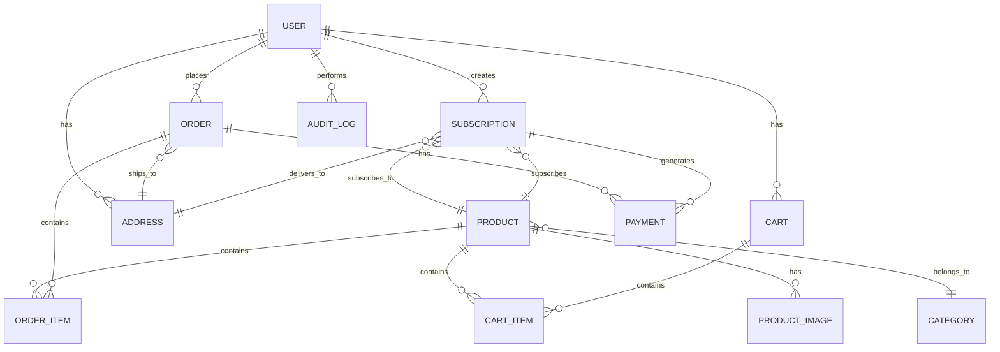

# Design Document

## Overview

IndoStar Naturals is a full-stack e-commerce platform built with a modern, scalable architecture. The system uses a React/TypeScript frontend with Tailwind CSS, a Python FastAPI backend exposing RESTful JSON APIs, PostgreSQL for data persistence, and integrates with Razorpay for payment processing and subscriptions. The architecture follows clean separation of concerns with distinct layers for presentation, business logic, and data access.

The application serves three user roles with distinct interfaces and permissions: consumers who purchase products at retail prices, distributors who access wholesale pricing, and owners who manage the entire system. All product data is dynamically managed—no hardcoded demo data exists in the system.

## Architecture

### High-Level Architecture



### Technology Stack

**Frontend:**
- React 18 with TypeScript for type safety
- Tailwind CSS for responsive, utility-first styling
- React Router for client-side routing
- Axios for HTTP requests with interceptors for JWT handling
- React Query for server state management and caching
- Formik + Yup for form handling and validation
- Razorpay Checkout SDK for payment UI

**Backend:**
- Python 3.11+
- FastAPI framework for high-performance async APIs
- Pydantic for request/response validation
- SQLAlchemy 2.0 for ORM
- Alembic for database migrations
- Python-Jose for JWT token handling
- Passlib with bcrypt for password hashing
- Celery for background task processing
- Redis for caching and Celery broker

**Database:**
- PostgreSQL 15+ for primary data store
- Redis for session caching and task queue

**Infrastructure:**
- Docker and Docker Compose for containerization
- GitHub Actions for CI/CD
- AWS S3 or DigitalOcean Spaces for media storage
- Sentry for error tracking and monitoring
- Nginx as reverse proxy

**External Integrations:**
- Razorpay for payments and subscriptions
- Twilio or MSG91 for SMS OTP
- SendGrid or AWS SES for email
- Google OAuth 2.0 for social authentication

### Deployment Architecture

```mermaid
graph LR
    subgraph "CDN"
        CDN[CloudFront/CDN]
    end
    
    subgraph "Load Balancer"
        LB[Application Load Balancer]
    end
    
    subgraph "Application Tier"
        API1[FastAPI Instance 1]
        API2[FastAPI Instance 2]
        Worker1[Celery Worker 1]
        Worker2[Celery Worker 2]
    end
    
    subgraph "Data Tier"
        PG[(PostgreSQL Primary)]
        PGR[(PostgreSQL Replica)]
        Redis[(Redis Cluster)]
    end
    
    subgraph "Storage"
        S3[S3 Bucket]
    end
    
    CDN --> LB
    LB --> API1
    LB --> API2
    
    API1 --> PG
    API2 --> PG
    API1 --> Redis
    API2 --> Redis
    
    Worker1 --> PG
    Worker2 --> PG
    Worker1 --> Redis
    Worker2 --> Redis
    
    PG --> PGR
    
    API1 --> S3
    API2 --> S3
```

## Components and Interfaces

### Frontend Components

**Page Components:**
- `HomePage`: Hero banner, featured products, categories, subscription CTA
- `ProductCatalogPage`: Product grid with filters, search, sorting, pagination
- `ProductDetailPage`: Image carousel, pricing, add-to-cart, subscription options
- `CartPage`: Cart items, quantity controls, coupon input, checkout button
- `CheckoutPage`: Delivery address form, payment method selection, order summary
- `OrderHistoryPage`: List of past orders with status tracking
- `SubscriptionManagementPage`: Active subscriptions with pause/resume/cancel controls
- `ConsumerDashboardPage`: Orders, subscriptions, profile, addresses
- `DistributorDashboardPage`: Orders with distributor pricing, account status
- `OwnerDashboardPage`: Analytics, product management, order management, user management

**Shared Components:**
- `Header`: Navigation, search bar, cart icon, user menu
- `Footer`: Links, contact information, social media
- `ProductCard`: Product image, title, price, add-to-cart button
- `AuthModal`: Login/signup forms with OTP, email, Google OAuth options
- `AddressForm`: Reusable address input form with validation
- `PriceDisplay`: Shows appropriate price based on user role
- `ImageCarousel`: Product image gallery with thumbnails
- `FilterSidebar`: Category, price range, availability filters
- `OrderStatusBadge`: Visual indicator for order status
- `LoadingSpinner`: Loading state indicator
- `ErrorBoundary`: Error handling wrapper

**Context Providers:**
- `AuthContext`: User authentication state, login/logout functions
- `CartContext`: Cart state and operations
- `ThemeContext`: Consistent styling theme across application

### Backend API Endpoints

**Authentication Endpoints:**
```
POST   /api/v1/auth/send-otp          # Send OTP to phone/email
POST   /api/v1/auth/verify-otp        # Verify OTP and return JWT
POST   /api/v1/auth/google            # Google OAuth callback
POST   /api/v1/auth/refresh           # Refresh JWT token
POST   /api/v1/auth/reset-password    # Request password reset
PUT    /api/v1/auth/reset-password    # Complete password reset
```

**User Endpoints:**
```
GET    /api/v1/users/me               # Get current user profile
PUT    /api/v1/users/me               # Update user profile
GET    /api/v1/users/me/addresses     # Get user addresses
POST   /api/v1/users/me/addresses     # Add new address
PUT    /api/v1/users/me/addresses/:id # Update address
DELETE /api/v1/users/me/addresses/:id # Delete address
```

**Product Endpoints:**
```
GET    /api/v1/products               # List products (paginated, filtered)
GET    /api/v1/products/:id           # Get product details
GET    /api/v1/categories             # List categories
GET    /api/v1/products/search        # Search products
```

**Owner Product Management:**
```
POST   /api/v1/owner/products         # Create product
PUT    /api/v1/owner/products/:id     # Update product
DELETE /api/v1/owner/products/:id     # Delete product
POST   /api/v1/owner/products/:id/images  # Upload product images
DELETE /api/v1/owner/products/:id/images/:imageId  # Delete image
PUT    /api/v1/owner/products/:id/stock   # Update stock quantity
```

**Cart Endpoints:**
```
GET    /api/v1/cart                   # Get user's cart
POST   /api/v1/cart/items             # Add item to cart
PUT    /api/v1/cart/items/:id         # Update cart item quantity
DELETE /api/v1/cart/items/:id         # Remove item from cart
POST   /api/v1/cart/coupon            # Apply coupon code
DELETE /api/v1/cart/coupon            # Remove coupon
```

**Order Endpoints:**
```
POST   /api/v1/orders                 # Create order (initiate checkout)
GET    /api/v1/orders                 # Get user's orders
GET    /api/v1/orders/:id             # Get order details
```

**Owner Order Management:**
```
GET    /api/v1/owner/orders           # List all orders (filtered)
PUT    /api/v1/owner/orders/:id/status # Update order status
POST   /api/v1/owner/orders/:id/refund # Process refund
```

**Subscription Endpoints:**
```
POST   /api/v1/subscriptions          # Create subscription
GET    /api/v1/subscriptions          # Get user's subscriptions
GET    /api/v1/subscriptions/:id      # Get subscription details
PUT    /api/v1/subscriptions/:id/pause # Pause subscription
PUT    /api/v1/subscriptions/:id/resume # Resume subscription
DELETE /api/v1/subscriptions/:id      # Cancel subscription
```

**Owner Subscription Management:**
```
GET    /api/v1/owner/subscriptions    # List all subscriptions
GET    /api/v1/owner/subscriptions/calendar # Delivery calendar view
```

**Payment Webhook:**
```
POST   /api/v1/webhooks/razorpay      # Razorpay webhook handler
```

**Owner Analytics:**
```
GET    /api/v1/owner/analytics/dashboard # Dashboard metrics
GET    /api/v1/owner/analytics/revenue   # Revenue reports
GET    /api/v1/owner/inventory           # Inventory status
GET    /api/v1/owner/users               # User management
PUT    /api/v1/owner/users/:id/role      # Update user role
GET    /api/v1/owner/audit-logs          # Audit log viewer
```

### Service Layer Interfaces

**UserService:**
```python
class UserService:
    async def create_user(email: str, phone: str, role: UserRole) -> User
    async def authenticate_with_otp(phone: str, otp: str) -> tuple[User, str]
    async def authenticate_with_google(google_token: str) -> tuple[User, str]
    async def send_otp(phone: str) -> bool
    async def verify_email(token: str) -> User
    async def update_user_role(user_id: int, new_role: UserRole, actor_id: int) -> User
```

**ProductService:**
```python
class ProductService:
    async def create_product(product_data: ProductCreate, owner_id: int) -> Product
    async def update_product(product_id: int, product_data: ProductUpdate) -> Product
    async def get_products(filters: ProductFilters, user_role: UserRole) -> Page[Product]
    async def get_product_by_id(product_id: int, user_role: UserRole) -> Product
    async def update_stock(product_id: int, quantity_delta: int, actor_id: int) -> Product
    async def upload_image(product_id: int, image: UploadFile) -> ProductImage
    async def search_products(query: str, user_role: UserRole) -> list[Product]
```

**CartService:**
```python
class CartService:
    async def get_cart(user_id: int) -> Cart
    async def add_item(user_id: int, product_id: int, quantity: int) -> Cart
    async def update_item_quantity(user_id: int, item_id: int, quantity: int) -> Cart
    async def remove_item(user_id: int, item_id: int) -> Cart
    async def apply_coupon(user_id: int, coupon_code: str) -> Cart
    async def validate_cart(user_id: int) -> CartValidation
```

**OrderService:**
```python
class OrderService:
    async def create_order(user_id: int, address_id: int) -> Order
    async def get_user_orders(user_id: int, filters: OrderFilters) -> Page[Order]
    async def get_order_by_id(order_id: int) -> Order
    async def update_order_status(order_id: int, status: OrderStatus, actor_id: int) -> Order
    async def process_refund(order_id: int, actor_id: int) -> Order
```

**SubscriptionService:**
```python
class SubscriptionService:
    async def create_subscription(user_id: int, subscription_data: SubscriptionCreate) -> Subscription
    async def get_user_subscriptions(user_id: int) -> list[Subscription]
    async def pause_subscription(subscription_id: int, user_id: int) -> Subscription
    async def resume_subscription(subscription_id: int, user_id: int) -> Subscription
    async def cancel_subscription(subscription_id: int, user_id: int) -> Subscription
    async def process_subscription_charge(subscription_id: int) -> Order
```

**PaymentService:**
```python
class PaymentService:
    async def create_razorpay_order(order_id: int, amount: Decimal) -> RazorpayOrder
    async def create_razorpay_subscription(subscription_id: int, plan_id: str) -> RazorpaySubscription
    async def verify_payment_signature(payload: dict, signature: str) -> bool
    async def handle_payment_success(razorpay_payment_id: str, order_id: int) -> Payment
    async def handle_payment_failure(razorpay_payment_id: str, order_id: int) -> Payment
    async def handle_subscription_charged(razorpay_subscription_id: str) -> Payment
```

## Data Models

### User Model
```python
class User:
    id: int
    email: str | None
    phone: str
    name: str
    hashed_password: str | None
    role: UserRole  # CONSUMER, DISTRIBUTOR, OWNER
    google_id: str | None
    is_email_verified: bool
    is_phone_verified: bool
    is_active: bool
    created_at: datetime
    updated_at: datetime
```

### Product Model
```python
class Product:
    id: int
    owner_id: int
    title: str
    description: str
    category_id: int
    sku: str
    unit_size: str
    consumer_price: Decimal
    distributor_price: Decimal
    stock_quantity: int
    is_subscription_available: bool
    is_active: bool
    created_at: datetime
    updated_at: datetime
    
    # Relationships
    images: list[ProductImage]
    category: Category
```

### ProductImage Model
```python
class ProductImage:
    id: int
    product_id: int
    url: str
    alt_text: str
    display_order: int
    created_at: datetime
```

### Category Model
```python
class Category:
    id: int
    name: str
    slug: str
    parent_id: int | None
    display_order: int
```

### Cart Model
```python
class Cart:
    id: int
    user_id: int
    coupon_code: str | None
    discount_amount: Decimal
    created_at: datetime
    updated_at: datetime
    
    # Relationships
    items: list[CartItem]
```

### CartItem Model
```python
class CartItem:
    id: int
    cart_id: int
    product_id: int
    quantity: int
    unit_price: Decimal  # Locked price at time of adding
    created_at: datetime
    
    # Relationships
    product: Product
```

### Order Model
```python
class Order:
    id: int
    user_id: int
    order_number: str
    total_amount: Decimal
    discount_amount: Decimal
    final_amount: Decimal
    payment_status: PaymentStatus  # PENDING, PAID, FAILED, REFUNDED
    order_status: OrderStatus  # PENDING, CONFIRMED, PACKED, OUT_FOR_DELIVERY, DELIVERED, CANCELLED
    delivery_address_id: int
    notes: str | None
    created_at: datetime
    updated_at: datetime
    
    # Relationships
    items: list[OrderItem]
    delivery_address: Address
    payments: list[Payment]
```

### OrderItem Model
```python
class OrderItem:
    id: int
    order_id: int
    product_id: int
    quantity: int
    unit_price: Decimal
    total_price: Decimal
    
    # Relationships
    product: Product
```

### Address Model
```python
class Address:
    id: int
    user_id: int
    name: str
    phone: str
    address_line1: str
    address_line2: str | None
    city: str
    state: str
    postal_code: str
    country: str
    is_default: bool
    created_at: datetime
    updated_at: datetime
```

### Subscription Model
```python
class Subscription:
    id: int
    user_id: int
    product_id: int
    razorpay_subscription_id: str
    plan_frequency: SubscriptionFrequency  # DAILY, ALTERNATE_DAYS, WEEKLY
    start_date: date
    next_delivery_date: date
    delivery_address_id: int
    status: SubscriptionStatus  # ACTIVE, PAUSED, CANCELLED
    created_at: datetime
    updated_at: datetime
    
    # Relationships
    product: Product
    delivery_address: Address
```

### Payment Model
```python
class Payment:
    id: int
    order_id: int | None
    subscription_id: int | None
    razorpay_payment_id: str
    razorpay_order_id: str | None
    amount: Decimal
    currency: str
    status: PaymentStatus
    payment_method: str | None
    created_at: datetime
    updated_at: datetime
```

### AuditLog Model
```python
class AuditLog:
    id: int
    actor_id: int
    action_type: str  # PRODUCT_CREATED, PRICE_UPDATED, STOCK_UPDATED, etc.
    object_type: str  # PRODUCT, ORDER, USER, etc.
    object_id: int
    details: dict  # JSON field with old/new values
    ip_address: str | None
    created_at: datetime
```

### Database Relationships



## Correctness Properties

*A property is a characteristic or behavior that should hold true across all valid executions of a system—essentially, a formal statement about what the system should do. Properties serve as the bridge between human-readable specifications and machine-verifiable correctness guarantees.*

### Authentication and Authorization Properties

**Property 1: OTP verification issues JWT**
*For any* valid OTP code and user, when the OTP is verified, the system should return a valid JWT token that can be used for subsequent authenticated requests.
**Validates: Requirements 1.2**

**Property 2: Email verification marks account verified**
*For any* valid email verification token, when clicked, the system should mark the user's email as verified and authenticate the user.
**Validates: Requirements 1.4**

**Property 3: Password reset tokens expire**
*For any* password reset token, after 24 hours from creation, the token should be invalid and rejected by the system.
**Validates: Requirements 1.6**

**Property 4: Rate limiting blocks excessive auth attempts**
*For any* IP address, after 5 failed authentication attempts within 15 minutes, the 6th attempt should be blocked with a 429 Too Many Requests response.
**Validates: Requirements 1.7**

**Property 5: User creation assigns single role**
*For any* user account creation, the user should have exactly one role from the set {consumer, distributor, owner}.
**Validates: Requirements 2.1**

**Property 6: Consumer sees consumer prices**
*For any* consumer user and any product, the displayed price should equal the product's consumer_price field.
**Validates: Requirements 2.2**

**Property 7: Distributor sees distributor prices**
*For any* distributor user and any product, the displayed price should equal the product's distributor_price field.
**Validates: Requirements 2.3, 9.1**

**Property 8: Distributor requires approval**
*For any* distributor registration, the user's role should remain pending or inactive until an owner explicitly approves the account.
**Validates: Requirements 2.4**

**Property 9: Owner has full admin access**
*For any* owner user, all administrative endpoints (product management, inventory, orders, subscriptions, user management) should return 200 OK, not 403 Forbidden.
**Validates: Requirements 2.5**

**Property 10: Non-owners blocked from admin endpoints**
*For any* non-owner user (consumer or distributor) and any owner-only endpoint, the response should be 403 Forbidden.
**Validates: Requirements 2.6**

### Product Management Properties

**Property 11: Product creation requires all fields**
*For any* product creation attempt, if any required field (title, description, category, SKU, unit size, consumer price, distributor price, stock quantity) is missing, the system should reject the request with a 400 Bad Request response.
**Validates: Requirements 3.1**

**Property 12: Product image upload associates with product**
*For any* uploaded product image, the image should be stored and associated with the product, such that querying the product returns the image URL.
**Validates: Requirements 3.2**

**Property 13: Stock updates create audit logs**
*For any* product stock quantity update, the system should create an audit log entry containing actor_id, timestamp, old quantity, and new quantity.
**Validates: Requirements 3.3, 15.2**

**Property 14: Dual pricing stored and retrieved by role**
*For any* product with different consumer and distributor prices, when queried by a consumer, the consumer price should be returned, and when queried by a distributor, the distributor price should be returned.
**Validates: Requirements 3.4**

**Property 15: Soft delete hides products**
*For any* product marked as deleted, the product should not appear in catalog queries for consumers or distributors.
**Validates: Requirements 3.5**

### Product Browsing and Search Properties

**Property 16: Catalog pagination returns 20 items**
*For any* product catalog query without explicit page size, the system should return exactly 20 items per page (or fewer on the last page).
**Validates: Requirements 4.1**

**Property 17: Category filter returns matching products**
*For any* category filter applied to product catalog, all returned products should belong to the specified category.
**Validates: Requirements 4.2**

**Property 18: Search returns matching products**
*For any* search query, all returned products should contain the query terms in their title, description, or tags.
**Validates: Requirements 4.3**

**Property 19: Price sorting uses role-appropriate prices**
*For any* user and price sort request, the results should be ordered by consumer_price for consumers and distributor_price for distributors.
**Validates: Requirements 4.4**

**Property 20: Product detail includes all required fields**
*For any* product detail view, the response should include images, nutritional information, unit sizes, stock availability, and role-appropriate pricing.
**Validates: Requirements 4.5**

### Cart Management Properties

**Property 21: Cart additions persist**
*For any* product added to a user's cart, querying the cart should return that product with the specified quantity.
**Validates: Requirements 5.1**

**Property 22: Quantity updates recalculate total**
*For any* cart item quantity update, the cart total should equal the sum of (item quantity × item unit price) for all items.
**Validates: Requirements 5.2**

**Property 23: Valid coupon reduces cart total**
*For any* valid coupon code applied to a cart, the cart total should be reduced by the coupon's discount amount.
**Validates: Requirements 5.3**

**Property 24: Cart displays role-appropriate prices**
*For any* user viewing their cart, all item prices should match the user's role (consumer or distributor prices).
**Validates: Requirements 5.4**

**Property 25: Item removal updates cart**
*For any* cart item removed, the item should not appear in subsequent cart queries and the cart total should be recalculated.
**Validates: Requirements 5.5**

**Property 26: Insufficient stock blocks checkout**
*For any* cart containing items where quantity exceeds available stock, the checkout should be blocked and return a stock availability error.
**Validates: Requirements 5.6**

### Checkout and Payment Properties

**Property 27: Checkout validates stock**
*For any* checkout initiation, the system should verify that all cart items have sufficient stock before creating an order.
**Validates: Requirements 6.1**

**Property 28: Address validation requires all fields**
*For any* delivery address submission, if any required field (name, phone, address line, city, state, postal code) is missing, the system should reject with a 400 Bad Request response.
**Validates: Requirements 6.2**

**Property 29: Order confirmation creates Razorpay order**
*For any* order confirmation, the system should create a Razorpay order and return an order token to the frontend.
**Validates: Requirements 6.3**

**Property 30: Payment success updates order status**
*For any* valid Razorpay webhook indicating successful payment, the system should update the order status to confirmed.
**Validates: Requirements 6.4**

**Property 31: Payment failure updates order status**
*For any* valid Razorpay webhook indicating failed payment, the system should update the order status to failed.
**Validates: Requirements 6.5**

**Property 32: Order creation reduces stock**
*For any* order created, the stock quantity for each ordered product should be reduced by the ordered quantity.
**Validates: Requirements 6.6**

**Property 33: Webhook signature verification required**
*For any* webhook request without a valid Razorpay signature, the system should reject the request with a 401 Unauthorized response.
**Validates: Requirements 6.7, 12.3**

### Subscription Properties

**Property 34: Subscription products show options**
*For any* product marked as subscription_available, the product detail page should display subscription frequency options.
**Validates: Requirements 7.1**

**Property 35: Subscription creation requires all fields**
*For any* subscription creation attempt, if any required field (frequency, start date, delivery schedule) is missing, the system should reject with a 400 Bad Request response.
**Validates: Requirements 7.2**

**Property 36: Subscription confirmation creates Razorpay subscription**
*For any* subscription confirmation, the system should create a Razorpay subscription and store the razorpay_subscription_id.
**Validates: Requirements 7.3**

**Property 37: Subscription charge creates order**
*For any* successful Razorpay subscription charge webhook, the system should create an order record with the subscription details.
**Validates: Requirements 7.4**

**Property 38: Paused subscriptions suspend billing**
*For any* paused subscription, no charges or deliveries should occur until the subscription is resumed.
**Validates: Requirements 7.5**

**Property 39: Cancelled subscriptions prevent charges**
*For any* cancelled subscription, the Razorpay subscription should be cancelled and no future charges should occur.
**Validates: Requirements 7.6**

### Order Management Properties

**Property 40: New orders start as pending**
*For any* newly created order, the initial order_status should be PENDING.
**Validates: Requirements 8.1**

**Property 41: Order status transitions are valid**
*For any* order status update, the new status should be one of the valid states: pending, confirmed, packed, out-for-delivery, delivered, cancelled, or refunded.
**Validates: Requirements 8.2**

**Property 42: Status changes trigger notifications**
*For any* order status change, the system should send an email notification to the customer.
**Validates: Requirements 8.3, 11.2**

**Property 43: Consumer sees own orders**
*For any* consumer viewing order history, the system should return only orders belonging to that consumer.
**Validates: Requirements 8.4**

**Property 44: Owner sees all orders**
*For any* owner viewing orders, the system should return orders from all users with support for filtering by status, date range, and user role.
**Validates: Requirements 8.5**

### Distributor-Specific Properties

**Property 45: Distributor cart uses distributor pricing**
*For any* distributor's cart, the cart total should be calculated using distributor_price for all items.
**Validates: Requirements 9.2**

**Property 46: Distributor checkout uses distributor pricing**
*For any* distributor order, the final_amount should be calculated using distributor_price for all items.
**Validates: Requirements 9.3**

**Property 47: Bulk discounts apply to qualifying orders**
*For any* distributor order meeting bulk discount quantity thresholds, the system should apply the additional discount to the order total.
**Validates: Requirements 9.4**

**Property 48: Distributor order history shows distributor pricing**
*For any* distributor viewing order history, all orders should display distributor prices and any applied bulk discounts.
**Validates: Requirements 9.5**

### Owner Dashboard Properties

**Property 49: Dashboard displays all metrics**
*For any* owner dashboard view, the response should include total revenue, order count, active subscriptions count, and low-stock alerts.
**Validates: Requirements 10.1**

**Property 50: Inventory reports show accurate stock**
*For any* inventory report query, the system should return current stock levels for all products with support for category filtering.
**Validates: Requirements 10.2**

**Property 51: Subscription calendar shows scheduled deliveries**
*For any* date in the subscription calendar, the system should display all subscriptions scheduled for delivery on that date.
**Validates: Requirements 10.3**

**Property 52: User management supports filtering**
*For any* user management query, the system should return users with support for filtering by role and account status.
**Validates: Requirements 10.4**

**Property 53: Distributor approval updates role and notifies**
*For any* distributor approval action, the system should update the user's role to distributor and send a confirmation email.
**Validates: Requirements 10.5**

### Notification Properties

**Property 54: Shipped orders trigger SMS**
*For any* order status change to out-for-delivery, the system should send an SMS notification with tracking information.
**Validates: Requirements 11.3**

**Property 55: Failed payments trigger email**
*For any* failed payment, the system should send an email notification with retry instructions.
**Validates: Requirements 11.4**

### Security Properties

**Property 56: Passwords hashed with bcrypt**
*For any* stored password, the hashed_password field should contain a bcrypt hash with cost factor >= 12.
**Validates: Requirements 12.1**

**Property 57: Malicious input rejected**
*For any* API request containing SQL injection patterns, XSS payloads, or other malicious input, the system should reject or sanitize the input.
**Validates: Requirements 12.2**

**Property 58: Rate limiting enforced**
*For any* IP address exceeding the request limit for rate-limited endpoints, subsequent requests should be blocked with a 429 Too Many Requests response.
**Validates: Requirements 12.6**

### Accessibility Properties

**Property 59: Images include alt text**
*For any* product image displayed, the image element should include descriptive alt text for screen readers.
**Validates: Requirements 13.4**

### Concurrency Properties

**Property 60: Concurrent stock updates are consistent**
*For any* set of concurrent stock quantity updates on the same product, the final stock quantity should equal the initial quantity plus the sum of all deltas, with no lost updates.
**Validates: Requirements 14.5**

### Audit Logging Properties

**Property 61: Price changes create audit logs**
*For any* product price update, the system should create an audit log entry containing actor_id, timestamp, old price, and new price.
**Validates: Requirements 15.1**

**Property 62: Role changes create audit logs**
*For any* user role update, the system should create an audit log entry containing actor_id, timestamp, affected user_id, old role, and new role.
**Validates: Requirements 15.3**

**Property 63: Audit logs support filtering**
*For any* audit log query, the system should support filtering by action type, date range, and actor.
**Validates: Requirements 15.4**

**Property 64: Payment attempts are logged**
*For any* payment attempt (success or failure), the system should create a log entry with transaction ID and status.
**Validates: Requirements 15.5**

### Data Validation Properties

**Property 65: Required form fields validated**
*For any* form submission, if any required field is missing, the system should reject with a 400 Bad Request response containing field-level errors.
**Validates: Requirements 16.1**

**Property 66: Email format validated**
*For any* email address input, if the format does not conform to RFC 5322 standards, the system should reject with a validation error.
**Validates: Requirements 16.2**

**Property 67: Phone format validated**
*For any* phone number input, if the format is invalid or missing country code, the system should reject with a validation error.
**Validates: Requirements 16.3**

**Property 68: Price values validated**
*For any* product price input, if the value is negative, zero, or has more than two decimal places, the system should reject with a validation error.
**Validates: Requirements 16.4**

**Property 69: Stock cannot be negative**
*For any* stock quantity update, if the resulting stock would be negative, the system should reject the update.
**Validates: Requirements 16.5**

**Property 70: Order creation verifies stock atomically**
*For any* order creation, the system should verify cart items exist and have sufficient stock within a single database transaction.
**Validates: Requirements 16.6**

### Error Handling Properties

**Property 71: Validation errors return 400**
*For any* validation error, the system should return a 400 Bad Request response with specific field-level error messages.
**Validates: Requirements 17.1**

**Property 72: Authentication errors return 401**
*For any* authentication error (invalid credentials, expired token), the system should return a 401 Unauthorized response.
**Validates: Requirements 17.2**

**Property 73: Authorization errors return 403**
*For any* authorization error (insufficient permissions), the system should return a 403 Forbidden response without exposing sensitive information.
**Validates: Requirements 17.3**

**Property 74: Server errors return 500 and log**
*For any* unhandled server error, the system should return a 500 Internal Server Error response and log the full error details to the monitoring service.
**Validates: Requirements 17.4**

**Property 75: External service failures retry with backoff**
*For any* external service failure (Razorpay, SMS provider), the system should retry up to 3 times with exponential backoff before reporting failure.
**Validates: Requirements 17.5**

### Media Handling Properties

**Property 76: Image upload validates file type and size**
*For any* product image upload, if the file type is not JPEG, PNG, or WebP, or if the size exceeds 5MB, the system should reject with a validation error.
**Validates: Requirements 20.1**

**Property 77: Image upload stores and returns URL**
*For any* valid product image upload, the system should store the image in S3-compatible storage and return a CDN URL.
**Validates: Requirements 20.2**

**Property 78: Product images have multiple resolutions**
*For any* product image, the system should provide responsive image URLs with multiple resolutions for different screen sizes.
**Validates: Requirements 20.3**

**Property 79: Image deletion removes from storage**
*For any* product image deletion, the system should remove the image from S3 storage and remove the association from the product record.
**Validates: Requirements 20.4**


## Error Handling

### Error Response Format

All API errors follow a consistent JSON structure:

```json
{
  "error": {
    "code": "VALIDATION_ERROR",
    "message": "Validation failed",
    "details": [
      {
        "field": "email",
        "message": "Invalid email format"
      }
    ],
    "timestamp": "2024-01-15T10:30:00Z",
    "request_id": "req_abc123"
  }
}
```

### Error Categories

**Validation Errors (400):**
- Missing required fields
- Invalid data formats
- Business rule violations
- Stock availability issues

**Authentication Errors (401):**
- Invalid credentials
- Expired tokens
- Missing authentication headers
- Invalid OTP codes

**Authorization Errors (403):**
- Insufficient permissions
- Role-based access violations
- Resource ownership violations

**Not Found Errors (404):**
- Resource does not exist
- Invalid product/order/user IDs

**Conflict Errors (409):**
- Duplicate SKU
- Concurrent modification conflicts
- Stock quantity conflicts

**Rate Limit Errors (429):**
- Too many requests
- Authentication attempt limits exceeded

**Server Errors (500):**
- Unhandled exceptions
- Database connection failures
- External service failures (after retries)

### Error Handling Strategy

**Backend:**
- Use FastAPI exception handlers for consistent error responses
- Log all errors with full stack traces to Sentry
- Include request_id in all error responses for traceability
- Sanitize error messages to avoid exposing sensitive information
- Implement circuit breakers for external service calls

**Frontend:**
- Display user-friendly error messages
- Show field-level validation errors inline
- Provide retry options for transient failures
- Log errors to monitoring service
- Implement error boundaries to prevent full app crashes

### Retry Logic

**Payment Operations:**
- Retry failed Razorpay API calls up to 3 times
- Use exponential backoff: 1s, 2s, 4s
- Log all retry attempts

**SMS/Email Operations:**
- Retry failed notifications up to 3 times
- Use exponential backoff: 2s, 4s, 8s
- Queue failed notifications for manual review

**Database Operations:**
- Retry deadlock errors up to 3 times
- Use immediate retry with jitter
- Fail fast on constraint violations

## Testing Strategy

### Unit Testing

**Backend Unit Tests:**
- Test all service layer methods with mocked dependencies
- Test all Pydantic models for validation logic
- Test utility functions (password hashing, token generation, price calculations)
- Test database models and relationships
- Mock external services (Razorpay, SMS, email, S3)
- Use pytest with pytest-asyncio for async tests
- Target: 80%+ code coverage

**Frontend Unit Tests:**
- Test React components with React Testing Library
- Test custom hooks
- Test utility functions (formatting, validation)
- Test context providers
- Mock API calls with MSW (Mock Service Worker)
- Use Jest as test runner
- Target: 70%+ code coverage

### Property-Based Testing

**Property-Based Test Framework:**
- Use Hypothesis for Python backend property-based tests
- Configure each property test to run minimum 100 iterations
- Use custom strategies for domain models (products, orders, users)

**Property Test Implementation:**
- Each correctness property from the design document must be implemented as a property-based test
- Tag each test with a comment referencing the property: `# Feature: indostar-naturals-ecommerce, Property X: [property text]`
- Generate random valid inputs using Hypothesis strategies
- Test invariants, round-trip properties, and metamorphic properties
- Focus on core business logic: pricing, cart calculations, stock management, order processing

**Example Property Test Structure:**
```python
from hypothesis import given, strategies as st

# Feature: indostar-naturals-ecommerce, Property 22: Quantity updates recalculate total
@given(
    cart=cart_strategy(),
    item_id=st.integers(min_value=1),
    new_quantity=st.integers(min_value=1, max_value=100)
)
async def test_cart_quantity_update_recalculates_total(cart, item_id, new_quantity):
    # Update quantity
    updated_cart = await cart_service.update_item_quantity(
        user_id=cart.user_id,
        item_id=item_id,
        quantity=new_quantity
    )
    
    # Verify total equals sum of (quantity × unit_price)
    expected_total = sum(item.quantity * item.unit_price for item in updated_cart.items)
    assert updated_cart.total_amount == expected_total
```

### Integration Testing

**API Integration Tests:**
- Test complete API flows with real database (test database)
- Test webhook processing with simulated Razorpay webhooks
- Test authentication flows (OTP, email verification, Google OAuth)
- Test cart-to-order flow
- Test subscription creation and management
- Use pytest with test database fixtures
- Run in CI pipeline

**Database Integration Tests:**
- Test complex queries and joins
- Test transaction isolation and concurrency
- Test migration scripts
- Use PostgreSQL test container

### End-to-End Testing

**E2E Test Framework:**
- Use Playwright for browser automation
- Test critical user journeys from UI to database

**Critical E2E Flows:**
1. Consumer signup → browse products → add to cart → checkout → payment
2. Distributor signup → approval → browse with distributor pricing → checkout
3. Owner login → create product → upload images → set pricing
4. Consumer create subscription → pause → resume → cancel
5. Owner view orders → update status → process refund

**E2E Test Environment:**
- Use staging environment with test Razorpay account
- Use test SMS/email providers or mock services
- Reset database state between test runs
- Run nightly in CI pipeline

### Test Data Strategy

**Test Data Generation:**
- Use factories (Factory Boy) for creating test objects
- Use Hypothesis strategies for property-based test data
- No hardcoded test data in version control
- Generate realistic test data (names, addresses, phone numbers)

**Test Database:**
- Use separate test database
- Run migrations before tests
- Truncate tables between test suites
- Use database transactions for test isolation

### Performance Testing

**Load Testing:**
- Use Locust for load testing
- Test critical endpoints: product catalog, checkout, payment webhooks
- Simulate concurrent users: 100, 500, 1000
- Measure response times and error rates
- Run before major releases

**Stress Testing:**
- Test stock quantity updates under high concurrency
- Test webhook processing under load
- Identify bottlenecks and race conditions

### Security Testing

**Security Test Cases:**
- Test SQL injection prevention
- Test XSS prevention
- Test CSRF protection
- Test rate limiting
- Test webhook signature verification
- Test JWT token expiration and refresh
- Test role-based access control
- Use OWASP ZAP for automated security scanning

### Continuous Integration

**CI Pipeline (GitHub Actions):**
1. Lint code (flake8, black, eslint, prettier)
2. Run unit tests (backend + frontend)
3. Run integration tests
4. Run property-based tests
5. Generate coverage reports
6. Build Docker images
7. Run security scans
8. Deploy to staging (on main branch)

**Quality Gates:**
- All tests must pass
- Code coverage >= 80% for backend
- No critical security vulnerabilities
- Linting passes with no errors

## Deployment Strategy

### Containerization

**Docker Images:**
- `indostar-frontend`: React app served by Nginx
- `indostar-backend`: FastAPI application
- `indostar-worker`: Celery worker for background tasks

**Docker Compose (Development):**
```yaml
services:
  postgres:
    image: postgres:15
  redis:
    image: redis:7
  backend:
    build: ./backend
    depends_on: [postgres, redis]
  worker:
    build: ./backend
    command: celery worker
    depends_on: [postgres, redis]
  frontend:
    build: ./frontend
    depends_on: [backend]
```

### Environment Configuration

**Environment Variables:**
- `DATABASE_URL`: PostgreSQL connection string
- `REDIS_URL`: Redis connection string
- `JWT_SECRET_KEY`: Secret for JWT signing
- `RAZORPAY_KEY_ID`: Razorpay API key
- `RAZORPAY_KEY_SECRET`: Razorpay API secret
- `RAZORPAY_WEBHOOK_SECRET`: Webhook signature secret
- `SMS_PROVIDER_API_KEY`: Twilio/MSG91 API key
- `EMAIL_PROVIDER_API_KEY`: SendGrid/SES API key
- `GOOGLE_OAUTH_CLIENT_ID`: Google OAuth client ID
- `GOOGLE_OAUTH_CLIENT_SECRET`: Google OAuth secret
- `S3_BUCKET_NAME`: S3 bucket for media storage
- `S3_ACCESS_KEY`: S3 access key
- `S3_SECRET_KEY`: S3 secret key
- `SENTRY_DSN`: Sentry error tracking DSN
- `FRONTEND_URL`: Frontend application URL
- `BACKEND_URL`: Backend API URL

### Production Deployment

**Infrastructure:**
- Application Load Balancer for traffic distribution
- Auto-scaling group for backend instances (min: 2, max: 10)
- RDS PostgreSQL with Multi-AZ for high availability
- ElastiCache Redis cluster
- S3 bucket with CloudFront CDN for media
- Route 53 for DNS management

**Deployment Process:**
1. Run database migrations
2. Build and push Docker images to registry
3. Update ECS task definitions
4. Deploy backend services with rolling update
5. Deploy frontend to CDN
6. Run smoke tests
7. Monitor error rates and rollback if needed

**Database Migrations:**
- Use Alembic for schema migrations
- Run migrations before deploying new code
- Test migrations on staging first
- Keep migrations backward compatible when possible
- Backup database before major migrations

### Monitoring and Observability

**Application Monitoring:**
- Sentry for error tracking and alerting
- CloudWatch for infrastructure metrics
- Custom metrics: order count, revenue, active subscriptions
- API response time monitoring
- Database query performance monitoring

**Logging:**
- Structured JSON logs
- Log levels: DEBUG, INFO, WARNING, ERROR, CRITICAL
- Centralized log aggregation (CloudWatch Logs or ELK stack)
- Log retention: 30 days

**Alerting:**
- High error rate (> 5% of requests)
- Slow response times (p95 > 2 seconds)
- Database connection failures
- External service failures (Razorpay, SMS, email)
- Low stock alerts
- Failed payment webhooks

### Backup and Disaster Recovery

**Database Backups:**
- Automated daily backups with 30-day retention
- Point-in-time recovery enabled
- Test restore process monthly

**Media Backups:**
- S3 versioning enabled
- Cross-region replication for critical assets

**Disaster Recovery Plan:**
- RTO (Recovery Time Objective): 4 hours
- RPO (Recovery Point Objective): 1 hour
- Documented runbook for common failures
- Regular disaster recovery drills

## Security Considerations

### Authentication Security

- Passwords hashed with bcrypt (cost factor 12)
- JWT tokens with 1-hour expiration
- Refresh tokens with 7-day expiration
- OTP codes expire after 10 minutes
- Rate limiting on authentication endpoints
- Account lockout after 5 failed attempts

### Authorization Security

- Role-based access control (RBAC)
- Principle of least privilege
- Resource ownership validation
- No privilege escalation vulnerabilities

### Data Security

- All sensitive data encrypted at rest
- TLS 1.3 for data in transit
- Database connection encryption
- Secure credential storage (AWS Secrets Manager)
- PII data handling compliance

### API Security

- Input validation on all endpoints
- SQL injection prevention (parameterized queries)
- XSS prevention (output encoding)
- CSRF protection for state-changing operations
- Rate limiting per IP and per user
- Request size limits
- Webhook signature verification

### Payment Security

- PCI DSS compliance (using Razorpay)
- No card data stored on servers
- Webhook signature verification
- Idempotency keys for payment operations
- Audit logging for all payment events

### Infrastructure Security

- Security groups with minimal access
- Private subnets for database and backend
- WAF (Web Application Firewall) rules
- DDoS protection
- Regular security updates and patches
- Vulnerability scanning in CI/CD

## Performance Optimization

### Database Optimization

**Indexes:**
- `products(category_id, is_active)`
- `products(sku)` UNIQUE
- `orders(user_id, created_at)`
- `orders(order_status, created_at)`
- `cart_items(cart_id, product_id)`
- `subscriptions(user_id, status)`
- `audit_logs(actor_id, created_at)`
- Full-text search index on `products(title, description)`

**Query Optimization:**
- Use select_related and prefetch_related for joins
- Implement pagination for all list endpoints
- Use database connection pooling
- Cache frequently accessed data (product catalog, categories)

### Caching Strategy

**Redis Caching:**
- Product catalog (TTL: 5 minutes)
- Category list (TTL: 1 hour)
- User session data (TTL: 1 hour)
- Rate limiting counters (TTL: 15 minutes)

**CDN Caching:**
- Product images (TTL: 1 year with versioning)
- Static assets (TTL: 1 year with versioning)
- API responses for public endpoints (TTL: 1 minute)

### Frontend Optimization

- Code splitting by route
- Lazy loading for images
- Debouncing for search input
- Optimistic UI updates
- Service worker for offline support
- Responsive images with srcset
- Minification and compression

### API Optimization

- Async/await for I/O operations
- Background tasks for non-critical operations (emails, notifications)
- Batch operations for bulk updates
- GraphQL or field selection for flexible data fetching
- Response compression (gzip)

## Scalability Considerations

### Horizontal Scaling

- Stateless backend services
- Session data in Redis (shared state)
- Load balancer for traffic distribution
- Auto-scaling based on CPU and request count

### Database Scaling

- Read replicas for read-heavy operations
- Connection pooling
- Query optimization and indexing
- Partitioning for large tables (orders, audit_logs)

### Background Job Processing

- Celery workers for async tasks
- Separate queues for different task types
- Priority queues for critical tasks
- Dead letter queue for failed tasks

### Rate Limiting

- Per-IP rate limits
- Per-user rate limits
- Different limits for different endpoints
- Graceful degradation under load

## Future Enhancements

### Phase 2 Features

- Advanced analytics dashboard with charts
- Inventory forecasting
- Automated reorder points
- Multi-warehouse support
- Delivery route optimization
- Customer loyalty program
- Referral system
- Product reviews and ratings
- Wishlist functionality
- Gift cards and vouchers

### Phase 3 Features

- Mobile apps (iOS and Android)
- Push notifications
- In-app chat support
- Advanced search with filters
- Recommendation engine
- Multi-language support
- Multi-currency support
- Marketplace for multiple vendors
- API for third-party integrations
